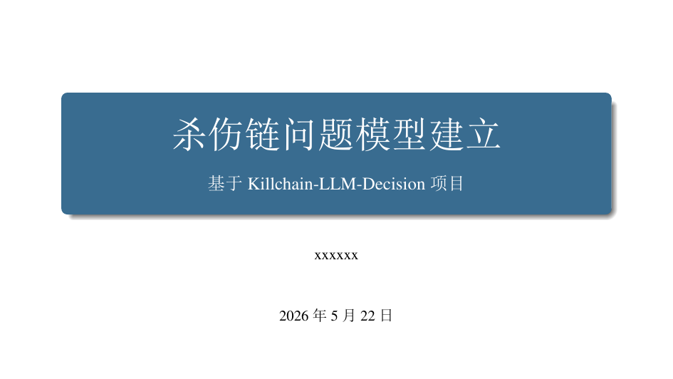
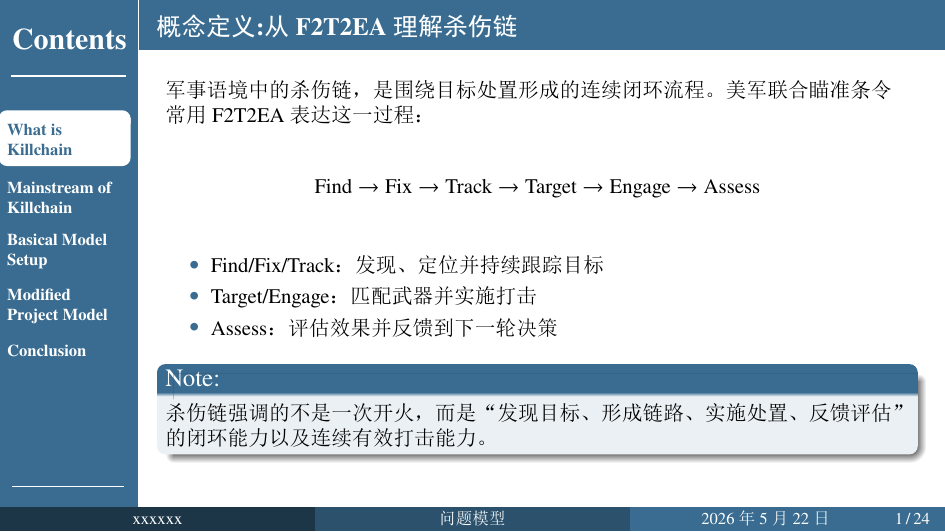
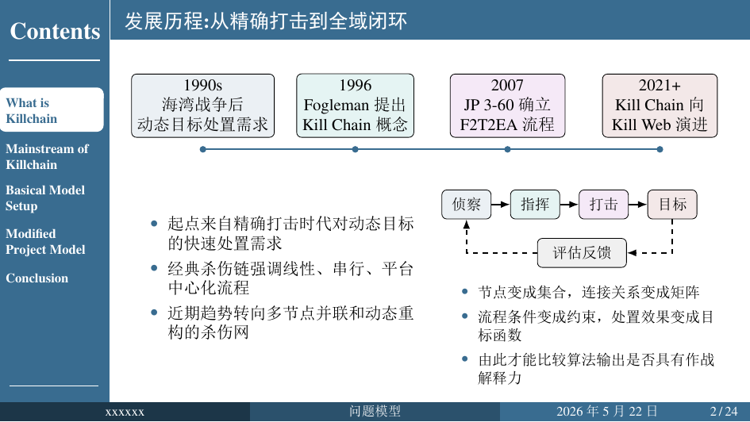

# ZXJTU Beamer 模板

一个面向中文课程汇报、组会展示和建模答辩场景的 Beamer 模板，基于自定义类 `ZXJTU.cls` 封装，默认提供中文排版、标题页、左侧目录和统一的区块样式。

当前仓库以 `main.tex` 作为完整课程汇报示例，内容已经覆盖概念说明、趋势梳理、公式表达、TikZ 图示和项目总结，适合作为后续改写与复用的起点。

## 效果展示

下面展示的是仓库内 `main.tex` 的实际编译结果，可直接作为 GitHub 首页预览。

### 标题页



### 正文页示例





## 模板特性

- 基于 Beamer `Madrid` 主题进行中文汇报风格定制
- 默认适配中文课程汇报，包含标题页、侧边目录和页脚信息
- 支持 `XeLaTeX` 与 `pdfLaTeX` 编译，其中中文环境更推荐 `XeLaTeX`
- 预置数学公式、表格、图片、TikZ 绘图等常用宏包
- 提供统一风格的 `RGBblock` 区块环境
- 支持用 `DeclareCustomBlockRGB` 声明可复用的自定义彩色区块
- 适合课程汇报、论文读书报告、项目答辩和数学建模展示

## 文件结构

```text
ZXJTU_Beamer/
├── ZXJTU.cls       # 模板类文件
├── main.tex        # 当前课程汇报示例
├── main.pdf        # 示例输出 PDF
├── preview-01.png  # README 展示图：标题页
├── preview-02.png  # README 展示图：正文页 1
├── preview-03.png  # README 展示图：正文页 2
└── README.md       # 项目说明文档
```

仓库中同时保留了 `.aux`、`.nav`、`.snm`、`.toc`、`.fls` 等 LaTeX 编译中间文件。若准备发布到 GitHub 并保持仓库整洁，可以后续补充 `.gitignore`。

## 快速开始

如果你想快速开始写一份课程汇报，建议直接以 `main.tex` 为模板改写，而不是从空白文档搭结构。

推荐顺序如下：

1. 复制 `main.tex`，改成自己的汇报文件名。
2. 替换标题、副标题、作者和日期信息。
3. 按章节改写内容页，保留现有的目录结构、区块样式和 TikZ 图示写法。
4. 用 `XeLaTeX` 或 `latexmk` 编译生成 PDF。

如果你只想保留模板骨架，也可以参考 `main.tex` 中的标题页、章节、普通内容页和 `RGBblock` 用法，抽出最小结构自行整理。

## 编译方式

### 推荐方式

建议优先使用 `XeLaTeX` 编译，尤其是在中文内容较多、需要更稳定字体效果时。

```bash
xelatex main.tex
```

如果使用 `latexmk`：

```bash
latexmk -xelatex main.tex
```

### 兼容说明

`ZXJTU.cls` 内部对引擎做了区分：

- `XeLaTeX`：通过 `fontspec` 和 `xeCJK` 处理中文字体
- `pdfLaTeX`：通过 `ctex` 提供中文支持

## 字体说明

模板在 `XeLaTeX` 模式下默认使用以下 Windows 字体：

- 宋体 `SimSun`
- 黑体 `SimHei`
- 楷体 `KaiTi`
- 微软雅黑 `Microsoft YaHei`

如果你在 macOS 或 Linux 下使用本模板，建议根据本机字体环境修改 `ZXJTU.cls` 中的字体设置。

## 常用参数

文档类可直接传入 Beamer 常见参数，例如：

- 字号：`8pt`、`9pt`、`10pt`、`11pt`、`12pt`
- 纵横比：`aspectratio=43`、`aspectratio=169`
- 其他 Beamer 原生选项也可直接透传给模板类

## 区块环境

### 默认区块 `RGBblock`

当前版本的 `RGBblock` 用于快速插入模板统一风格的信息块，不再通过环境参数临时传入颜色，而是改为使用模板内置的默认蓝色系风格。

它支持两个可选尺寸参数：

- `width`：控制区块宽度，适合在 `columns` 环境中排版
- `height`：控制区块高度，适合让并排区块视觉上保持一致

在当前示例 `main.tex` 中，已经给出了以下几类典型使用方式：

- 普通说明块
- 带固定高度的并排区块
- 用于 Note、问题模型、输入输出说明的强调块

### 自定义彩色区块 `DeclareCustomBlockRGB`

如果你希望在整套汇报中复用多种固定配色区块，可以使用 `DeclareCustomBlockRGB` 预先声明环境。

它的参数顺序如下：

1. 环境名称
2. 标题背景 RGB
3. 正文背景 RGB
4. 标题文字 RGB
5. 正文文字 RGB

这种方式适合在整套汇报中统一视觉层级，例如把“定义”“结论”“警示”“示例”拆分成不同颜色体系。

## 已加载的常用宏包

模板类内已经预置了一些常见宏包，包括但不限于：

- 数学：`mathtools`、`amsmath`、`amsfonts`、`amsthm`
- 字体：`fontspec`、`xeCJK` 或 `ctex`，按编译引擎自动切换
- 图形：`graphicx`、`tikz`
- 表格：`booktabs`、`multirow`、`array`
- 参考文献：`natbib`
- 其他：`caption`、`subfigure`、`comment`

如果你的文稿需要额外功能，可以在主 `.tex` 文件中继续添加宏包。

## 使用建议

- 课程汇报或读书报告：直接基于 `main.tex` 改写章节与公式内容最快
- 建模类汇报：优先使用公式、约束、Note 区块和 TikZ 图示组织表达
- 如果你需要统一团队模板，可集中在 `ZXJTU.cls` 中调整颜色、字体、侧边栏宽度和标题页样式

## 已知事项

- `XeLaTeX` 模式下默认字体偏向 Windows 环境，跨平台使用时通常需要自行调整字体配置
- 左侧目录从标题页之后开始显示，因此标题页建议单独使用无页码样式处理
- 模板目前未内置主题切换接口，如需更大幅度的视觉修改，建议直接调整 `ZXJTU.cls`

## 致谢

本模板在 Beamer 基础能力之上整理出了一套更适合中文课程汇报的默认结构与视觉风格，欢迎继续按个人或团队需求扩展使用。
